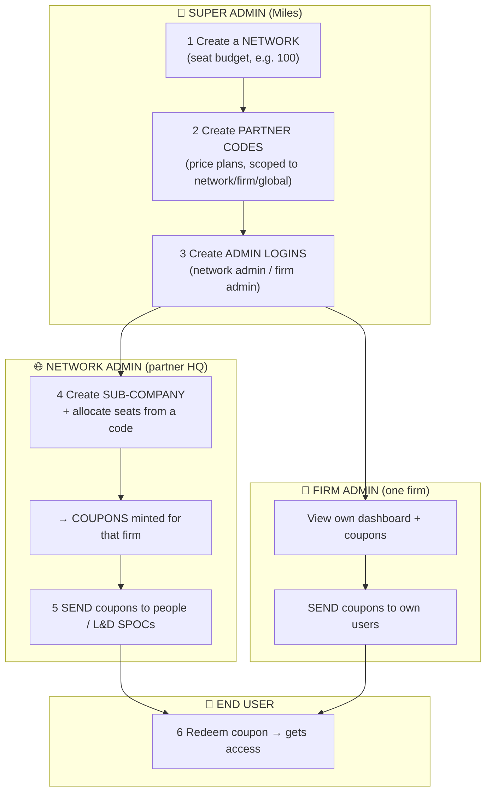

# Partner Platform — Complete Binding Spec (single source of truth)

Everything needed to build & bind the partner admin panel: the rules, how it actually works, every API (curl + real response + where to bind it), and a consistent mock dataset. If it isn't here, it isn't required.

---

## 0. SYSTEM PROMPT — read first

You are wiring the **Partner Platform** admin panel (Angular) to a Django backend. Hard rules — they resolve every past ambiguity:

1. **Code ≠ Coupon.** A **partner code** is a _price plan / template_ — creating one mints **nothing** and it **never shows in the coupon tracker**. A **coupon** is a _real seat/voucher_, created only by an **allocation**; the tracker shows coupons only.
2. **4-step lifecycle:** `1) create code (plan)` → `2) allocate seats → mints coupons` → `3) send coupon to a person` → `4) person redeems`.
3. **Scope is server-side.** The backend decides what a user sees from their login (`/me`). Never send a network/firm id to _widen_ scope (`firm_id` on the tracker only _filters_, for network admins).
4. **`coupon.firm` can be `null`** (a coupon minted to a network directly) → render `—`, guard every `firm.name` with `?.`.
5. **Capabilities gate the UI.** Read `me.capabilities`; hide actions the user can't perform.
6. **Errors are uniform:** `{ "status": false, "message": "..." }` with 400/401/403 → surface `message`.
7. **Two pagination shapes:** coupon endpoints return page **numbers**; the users endpoint returns full **URLs**.

**Base URL** `{{base}}` = `https://uat-api.milesmasterclass.com/api/reports` (prod: `https://api.milesmasterclass.com/api/reports`).
**Auth:** every request sends `Authorization: Bearer <supabase_access_token>` (one interceptor).

---

## 1. How it actually works (the workflow)

The whole product is **one flow across three roles**. Read this once and every screen makes sense.



**In words:**

1. **Super admin** creates a **network** (a seat budget) → creates **partner codes** (price plans) → creates the **admin logins** (network and/or firm).
2. **Network admin** logs in, creates **sub-companies (firms)** and **allocates seats** to them from a code → this **mints coupons**.
3. **Network/firm admin** **sends** each coupon (to a user or an L&D SPOC).
4. **End user** redeems the coupon → gets platform access.

**Where the confusion always came from:** step 1's "create code" produces a _plan_, not coupons. Coupons only exist after step 2 (allocate). The coupon tracker is a step-2+ screen.

**Standalone firm variant:** a single company (e.g. Deloitte) with no network — super admin creates the firm directly (with allocations) + a firm-admin login. Same steps, minus the network layer.

---

## 2. Bootstrap (before any screen)

```bash
curl "{{base}}/partner-admin/me/" -H "authorization: Bearer $TOKEN"
```

```json
// network admin
{ "supabase_uid":"acc1...","email":"hq@acme.com","role":"network",
  "network":{"id":11,"name":"Acme Alliance","slug":"acme-alliance"},"firm":null,
  "capabilities":["report:network:read","code:create:firm","coupon:send","user:block"] }
// firm admin (standalone → network null)
{ "supabase_uid":"b7c3...","email":"admin@deloitte.com","role":"firm",
  "network":null,"firm":{"id":18,"name":"Deloitte"},
  "capabilities":["report:network:read","coupon:send","user:block"] }
// not a partner admin
{ "is_partner_admin": false }
```

**🔗 Bind:** call once on app load. `role` picks the portal (super/network/firm). Show each action only if its capability is in `capabilities`. Store `network`/`firm` for headers/labels.

---

## 3. Mock dataset (build/test against this)

```jsonc
// Network
{ "id":11,"name":"Acme Alliance","slug":"acme-alliance","total_seats":100,"allocated":12,"unallocated":88,"is_active":true }
// Firms (sub-companies of network 11)
{ "id":16,"name":"Google","allocated":10,"used":3,"available":7,"is_active":true }
{ "id":17,"name":"Amazon","allocated":2,"used":0,"available":2,"is_active":true }
// Standalone firm (no network)
{ "id":18,"name":"Deloitte","network":null,"email_domain":"deloitte.com","is_active":true }
// Partner codes (plans)
{ "id":31,"code":"ACME-STD","discounted_price":"299.00","partner_network":11,"partner_firm":null,"auto_subscribe":false,"is_active":true }
{ "id":32,"code":"GLOBAL-99","discounted_price":"99.00","partner_network":null,"partner_firm":null,"auto_subscribe":false,"is_active":true }
{ "id":33,"code":"DELOITTE","discounted_price":"200.00","partner_network":null,"partner_firm":18,"auto_subscribe":false,"is_active":true }
// Coupons (real seats)
{ "id":101,"code":"GOOGLE-1A2B3C4D","purchase_cost":"299.00","expiry_date":null,"status":"applied","sent_to_email":"jane@google.com","shared_on":"2026-07-10T10:00:00Z","applied_on":"2026-07-11T08:00:00Z","applied_by":"jane@google.com","firm":{"id":16,"name":"Google"} }
{ "id":102,"code":"GOOGLE-9F8E7D6C","purchase_cost":"299.00","expiry_date":null,"status":"shared","sent_to_email":"spoc@google.com","shared_on":"2026-07-12T09:00:00Z","applied_on":null,"applied_by":null,"firm":{"id":16,"name":"Google"} }
{ "id":103,"code":"ACMEALLI-55AA11BB","purchase_cost":"299.00","expiry_date":null,"status":"available","sent_to_email":null,"shared_on":null,"applied_on":null,"applied_by":null,"firm":null }  // network-level, no sub-company
```

Statuses: `available → shared → applied`; `expired` derived from `expiry_date`.

---

## 4. SUPER ADMIN portal (`role = super`)

> Portal shown when `me.role === 'super'`. This is steps 1–3 of the workflow.

### 4.1 Networks list

**🔗 Bind:** Networks tab load → render table; "Create" button → 4.2; row click → 4.3.

```bash
curl "{{base}}/superadmin/networks/" -H "authorization: Bearer $TOKEN"
```

```json
{
  "networks": [
    {
      "id": 11,
      "name": "Acme Alliance",
      "slug": "acme-alliance",
      "total_seats": 100,
      "allocated": 12,
      "unallocated": 88,
      "is_active": true
    }
  ]
}
```

### 4.2 Create network

**🔗 Bind:** create-network modal submit → on success close + refresh list; on 400 show `message`.

```bash
curl -X POST "{{base}}/superadmin/networks/" -H "authorization: Bearer $TOKEN" -H "content-type: application/json" \
  -d '{"name":"Acme Alliance","slug":"acme-alliance","total_seats":100}'
```

```json
{
  "status": true,
  "network": {
    "id": 11,
    "name": "Acme Alliance",
    "slug": "acme-alliance",
    "total_seats": 100,
    "allocated": 0,
    "unallocated": 100,
    "is_active": true
  }
}
// 400 → { "status":false,"message":"A network with slug 'acme-alliance' already exists." }
```

### 4.3 Network detail / tracker

**🔗 Bind:** open a network → render `summary` stat cards + `sub_companies` table.

```bash
curl "{{base}}/superadmin/networks/11/" -H "authorization: Bearer $TOKEN"
```

```json
{
  "summary": {
    "network": { "id": 11, "name": "Acme Alliance", "slug": "acme-alliance" },
    "total_seats": 100,
    "allocated": 12,
    "unallocated": 88,
    "used": 3,
    "available": 8,
    "shared": 1,
    "applied": 3,
    "expired": 0
  },
  "sub_companies": [
    { "id": 16, "name": "Google", "allocated": 10, "used": 3, "available": 7, "is_active": true }
  ]
}
```

### 4.4 Edit network / stock its pool

**🔗 Bind:** edit-network form → PATCH with `{name,total_seats,is_active}`. Optional "add seats to network" → same PATCH with `allocations` (mints coupons with **no sub-company**).

```bash
curl -X PATCH "{{base}}/superadmin/networks/11/" -H "authorization: Bearer $TOKEN" -H "content-type: application/json" \
  -d '{"total_seats":120,"allocations":[{"partner_code_id":31,"count":5}]}'
```

```json
{
  "status": true,
  "network": {
    "id": 11,
    "name": "Acme Alliance",
    "slug": "acme-alliance",
    "total_seats": 120,
    "allocated": 17,
    "unallocated": 103,
    "is_active": true
  },
  "coupons_minted": 5
}
```

### 4.5 Partner codes — list / create

**🔗 Bind:** Codes tab → list table (scope column = network/firm/global). "Create" → POST with a **scope picker**: network → `partner_network_id`; firm → `partner_firm_id`; global → neither (never both).

```bash
curl "{{base}}/superadmin/partner-codes/" -H "authorization: Bearer $TOKEN"
curl -X POST "{{base}}/superadmin/partner-codes/" -H "authorization: Bearer $TOKEN" -H "content-type: application/json" \
  -d '{"code":"ACME-STD","discounted_price":299,"partner_network_id":11}'
```

```json
{
  "partner_codes": [
    {
      "id": 31,
      "code": "ACME-STD",
      "discounted_price": "299.00",
      "partner_network": 11,
      "partner_firm": null,
      "auto_subscribe": false,
      "is_active": true
    }
  ]
}
// create 201 → { "status":true,"partner_code":{"id":31,"code":"ACME-STD"} }
// 400 → "a partner code is scoped to a network OR a firm, not both."
```

### 4.6 Firms — list / create

**🔗 Bind:** Firms tab → list (filter `?network_id=` or `?standalone=1`). "Create firm" → POST; omit `network_id` for standalone; `allocations` must use **network/global** codes.

```bash
curl "{{base}}/superadmin/firms/?network_id=11" -H "authorization: Bearer $TOKEN"
curl -X POST "{{base}}/superadmin/firms/" -H "authorization: Bearer $TOKEN" -H "content-type: application/json" \
  -d '{"name":"Deloitte","email_domain":"deloitte.com","allocations":[{"partner_code_id":32,"count":10}]}'
```

```json
{
  "firms": [
    { "id": 16, "name": "Google", "network": 11, "email_domain": "google.com", "is_active": true }
  ]
}
// create 201 → { "status":true,"firm":{"id":18,"name":"Deloitte","network":null},"coupons_minted":10 }
```

### 4.7 Create partner-admin login

**🔗 Bind:** after creating the Supabase user (need its `sub`) → POST. Network admin: `role:"network"`+`network_id`+`code:create:firm`. Firm admin: `role:"firm"`+`firm_id`, omit `code:create:firm`.

```bash
curl -X POST "{{base}}/superadmin/partner-admins/" -H "authorization: Bearer $TOKEN" -H "content-type: application/json" \
  -d '{"supabase_uid":"acc1...","email":"hq@acme.com","role":"network","network_id":11,"capabilities":["report:network:read","code:create:firm","coupon:send","user:block"]}'
```

```json
{
  "status": true,
  "partner_admin": {
    "id": 3,
    "supabase_uid": "acc1...",
    "role": "network",
    "network": 11,
    "firm": null
  }
}
```

### 4.8 Coupon tracker (any network/firm)

**🔗 Bind:** viewing a network's/firm's coupons → exactly one of `network_id`/`firm_id` (+ status/page). Render rows; `firm` may be `null` → `—`.

```bash
curl "{{base}}/superadmin/coupons/?network_id=11&page=1&page_size=20" -H "authorization: Bearer $TOKEN"
```

```json
{
  "coupons": [/* rows, see mock #101–103 */],
  "pagination_data": {
    "total_count": 12,
    "current_page_number": 1,
    "next_page": null,
    "previous_page": null
  }
}
// neither param → 400 "network_id or firm_id is required."
```

---

## 5. NETWORK ADMIN portal (`role = network`)

> Portal shown when `me.role === 'network'`. This is steps 4–5. Uses the admin's own network (from `me`) — no ids passed to widen scope.

### 5.1 Dashboard

**🔗 Bind:** portal home → stat cards from the response.

```bash
curl "{{base}}/partner-admin/dashboard/" -H "authorization: Bearer $TOKEN"
```

```json
{
  "network": { "id": 11, "name": "Acme Alliance", "slug": "acme-alliance" },
  "total_seats": 100,
  "allocated": 12,
  "unallocated": 88,
  "used": 3,
  "available": 8,
  "shared": 1,
  "applied": 3,
  "expired": 0
}
```

### 5.2 Partner-code dropdown (feeds 5.4)

**🔗 Bind:** load when opening the Create-Sub-company modal → populate the plan dropdown.

```bash
curl "{{base}}/partner-admin/partner-codes/" -H "authorization: Bearer $TOKEN"
```

```json
{
  "partner_codes": [
    {
      "id": 31,
      "code": "ACME-STD",
      "discounted_price": "299.00",
      "partner_network": 11,
      "partner_firm": null,
      "auto_subscribe": false,
      "is_active": true
    }
  ]
}
```

### 5.3 Sub-companies list

**🔗 Bind:** firms section → table (allocated/used/available). Row → filter the tracker (5.5) by `firm_id`.

```bash
curl "{{base}}/partner-admin/sub-companies/" -H "authorization: Bearer $TOKEN"
```

```json
{
  "sub_companies": [
    { "id": 16, "name": "Google", "allocated": 10, "used": 3, "available": 7, "is_active": true }
  ]
}
```

### 5.4 Create sub-company (+ mint coupons) — the key action

**🔗 Bind:** "Create Sub-company" button (show only if `code:create:firm`). Modal: name, email_domain, and **per-code seat count** (from 5.2). On success → refresh 5.3 + 5.5.

```bash
curl -X POST "{{base}}/partner-admin/sub-companies/" -H "authorization: Bearer $TOKEN" -H "content-type: application/json" \
  -d '{"name":"Google","email_domain":"google.com","allocations":[{"partner_code_id":31,"count":10}]}'
```

```json
{
  "status": true,
  "firm": { "id": 16, "name": "Google" },
  "coupons_minted": 10,
  "network": { "id": 11, "unallocated_seats": 90 }
}
```

### 5.5 Coupon tracker

**🔗 Bind:** main table. `?firm_id=` when a firm is selected; `?status=` for filter tabs; `?page=/?page_size=` for paging (page **numbers**). Sub-company column: `firm?.name ?? '—'`.

```bash
curl "{{base}}/partner-admin/coupons/?page=1&page_size=20" -H "authorization: Bearer $TOKEN"
```

```json
{
  "coupons": [/* rows incl. one with "firm":null → "—" */],
  "pagination_data": {
    "total_count": 12,
    "current_page_number": 1,
    "next_page": 2,
    "previous_page": null
  }
}
```

### 5.6 Send a coupon

**🔗 Bind:** per-row email box + Send (needs `coupon:send`) → on success set row to `shared` + show `sent_to_email`.

```bash
curl -X POST "{{base}}/partner-admin/coupons/102/send/" -H "authorization: Bearer $TOKEN" -H "content-type: application/json" -d '{"email":"someone@google.com"}'
```

```json
{
  "status": true,
  "coupon": { "id": 102, "status": "shared", "sent_to_email": "someone@google.com" }
}
```

### 5.7 Users (list / export / block)

**🔗 Bind:** Users tab. List paging uses **full URLs**. Block toggle → POST. Sends `email_domain` (comma-joined) **only when** the signed-in admin has rows in `admin_user_email_domains` (from `get_my_admin_profile`); otherwise omitted and the backend scopes by token.

```bash
curl "{{base}}/partner-admin/users/?page=1&search=&blocked_status=all" -H "authorization: Bearer $TOKEN"
curl "{{base}}/partner-admin/users/export-csv/?blocked_status=all" -H "authorization: Bearer $TOKEN" -o users.csv
curl -X POST "{{base}}/partner-admin/users/57/block-status/" -H "authorization: Bearer $TOKEN" -H "content-type: application/json" -d '{"is_blocked":true,"reason":"left the firm"}'
```

```json
// list
{
  "data": [
    {
      "id": 57,
      "name": "Jane Doe",
      "email": "jane@google.com",
      "is_blocked": false,
      "courses_completed_cpe": 3,
      "cpe_credits_earned": 12,
      "...": "more counts + *_ids arrays"
    }
  ],
  "pagination_data": {
    "total_count": 42,
    "current_page_number": 1,
    "next_page": "https://.../users/?page=2",
    "previous_page": null
  }
}
// block → { "status":true,"is_blocked":true,"user_id":57 }
```

---

## 6. FIRM ADMIN portal (`role = firm`)

> Portal shown when `me.role === 'firm'`. Same `/partner-admin/*` calls as §5 — backend auto-scopes to the firm. Bind the same components with these differences:

- **5.1 Dashboard** → returns a **firm** block (no total_seats/unallocated): `{ "firm":{"id":18,"name":"Deloitte","network":null,"email_domain":"deloitte.com"},"allocated":10,"used":0,"available":10,"shared":0,"applied":0,"expired":0 }`. Render firm cards; label with firm name (`me.network` may be null).
- **5.5 Coupon tracker** → returns **only this firm's** coupons; any `firm_id` you send is ignored. Same render.
- **5.6 Send** + **5.7 Users/Export/Block** → identical.
- **Hide 5.3/5.4 (sub-companies)** → firm admins can't create firms (403; no `code:create:firm`).
- **5.2 partner-codes** → returns the firm's own + its network's codes (for display; firm admins don't create sub-companies).

---

## 7. Screen → API map

| Screen / action             | API                                                                             | Fires on         | Portal       |
| --------------------------- | ------------------------------------------------------------------------------- | ---------------- | ------------ |
| App load                    | `GET /partner-admin/me/`                                                        | boot             | all          |
| Networks list / create      | `GET`·`POST /superadmin/networks/`                                              | tab · submit     | super        |
| Network detail              | `GET /superadmin/networks/<id>/`                                                | open             | super        |
| Edit / stock network        | `PATCH /superadmin/networks/<id>/`                                              | submit           | super        |
| Codes list / create         | `GET`·`POST /superadmin/partner-codes/`                                         | tab · submit     | super        |
| Firms list / create         | `GET`·`POST /superadmin/firms/`                                                 | tab · submit     | super        |
| Create admin login          | `POST /superadmin/partner-admins/`                                              | submit           | super        |
| Coupon tracker (any)        | `GET /superadmin/coupons/?network_id=\|firm_id=`                                | open             | super        |
| Dashboard                   | `GET /partner-admin/dashboard/`                                                 | home             | network·firm |
| Sub-companies               | `GET /partner-admin/sub-companies/`                                             | load             | network      |
| Code dropdown               | `GET /partner-admin/partner-codes/`                                             | open modal       | network·firm |
| Create sub-company          | `POST /partner-admin/sub-companies/`                                            | submit           | network      |
| Coupon tracker              | `GET /partner-admin/coupons/`                                                   | load·filter·page | network·firm |
| Per-firm coupons            | `GET /partner-admin/firms/<id>/coupons/`                                        | drill-in         | network·firm |
| Send coupon                 | `POST /partner-admin/coupons/<id>/send/`                                        | click Send       | network·firm |
| Users list / export / block | `GET /partner-admin/users/` · `.../export-csv/` · `POST .../<id>/block-status/` | tab · click      | network·firm |

---

## 8. Definition of done

- `/me` drives portal + capability gating (no hard-coded roles).
- Coupon tracker shows rows with a sub-company **and** rows with `—` (firm null); search never throws.
- Create-sub-company: pick code(s) from `/partner-admin/partner-codes/`, enter seat count, submit → coupons appear.
- Coupon paging = page numbers; users paging = URLs.
- `email_domain` sent on users list/export only when the admin has a domain mapping.
- Errors surface the backend `message`.
- Build + lint pass.

## 9. Known backend gaps (don't wait on these)

| Gap                                        | Effect                                                                               |
| ------------------------------------------ | ------------------------------------------------------------------------------------ |
| Voucher email on send                      | status → `shared`, no email dispatched yet                                           |
| Allocate seats to an **existing** firm     | no endpoint — a firm made without allocations can't get coupons from the panel later |
| Network-level pool (`PATCH … allocations`) | works only once that backend change is deployed                                      |
| Apply-from-panel (redeem)                  | not built — redemption is in the end-user app                                        |
