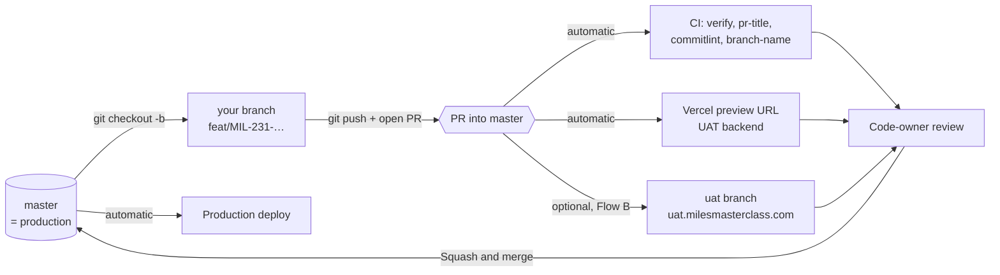
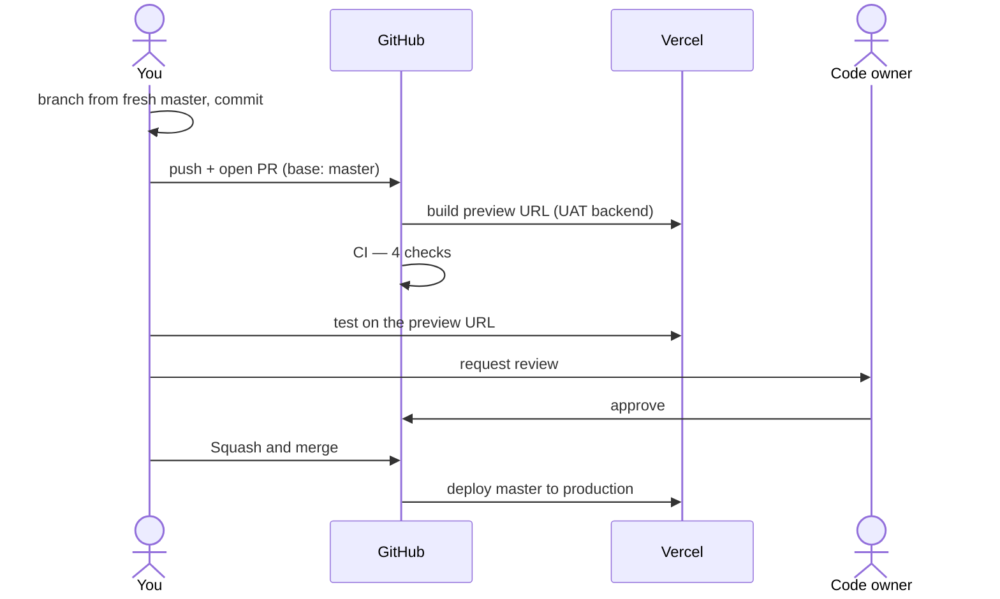
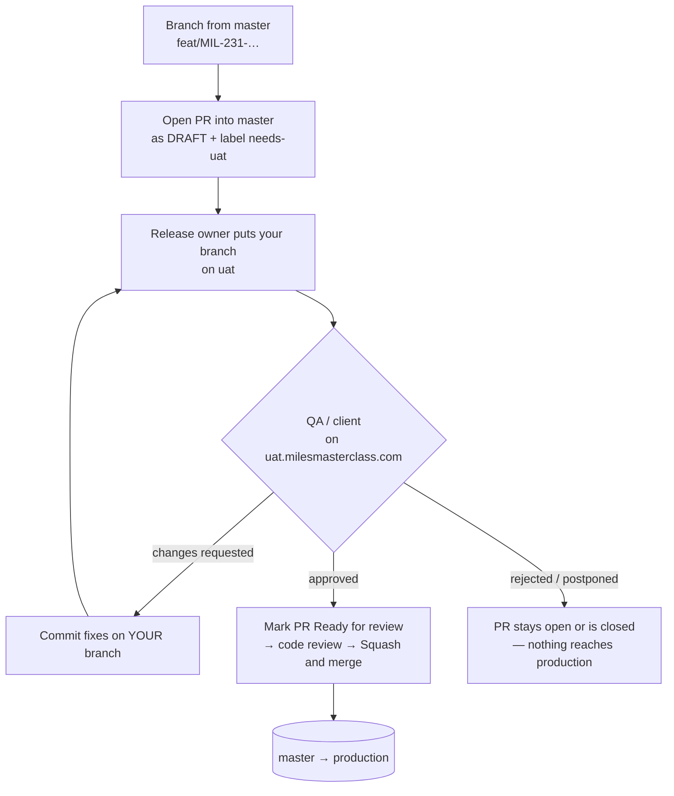

# Git playbook — step by step, for every situation

This is the **"what do I type"** guide. Find your situation in the table of contents, copy the commands,
done. The reasons behind the rules live in [`git-workflow.md`](git-workflow.md) (branching and PRs) and
[`versioning.md`](versioning.md) (releases). You don't need to read those to follow this.

**Contents**

1. [The 5 rules you cannot break](#1-the-5-rules-you-cannot-break)
2. [The picture: how code reaches production](#2-the-picture-how-code-reaches-production)
3. [Pick your branch type](#3-pick-your-branch-type)
4. [Flow A — normal work (feature, fix, chore, …) → production](#4-flow-a--normal-work--production)
5. [Flow B — needs staging (UAT) sign-off before production](#5-flow-b--needs-staging-uat-sign-off-before-production)
6. [Flow C — hotfix: production is broken](#6-flow-c--hotfix-production-is-broken)
7. [Flow D — undo something that is already in production](#7-flow-d--undo-something-already-in-production)
8. [Flow E — my work depends on someone else's unmerged branch](#8-flow-e--my-work-depends-on-someone-elses-unmerged-branch)
9. [Ship only what's needed — keeping other code out of your PR](#9-ship-only-whats-needed--keeping-other-code-out-of-your-pr)
10. [How to write the PR](#10-how-to-write-the-pr)
11. [Keeping your branch up to date](#11-keeping-your-branch-up-to-date)
12. [Releases (version numbers)](#12-releases-version-numbers)
13. [Bot PRs (Dependabot, release-please)](#13-bot-prs-dependabot-release-please)
14. [CI failed — what does it mean?](#14-ci-failed--what-does-it-mean)
15. [Oops — recovery recipes](#15-oops--recovery-recipes)
16. [Cheat sheet](#16-cheat-sheet)

---

## 1. The 5 rules you cannot break

1. **Every branch starts from `master`.** Not from `uat`, not from your last branch, not from a colleague's branch.
2. **Every PR goes into `master`.** Never into `uat`, never into another feature branch.
3. **Merging a PR = deploying to production.** Vercel ships `master` the moment your PR merges. If it
   needs QA or client sign-off, that happens **before** you press merge (Flow B).
4. **Branch name = `type/MIL-123-short-description`.** Anything else is rejected by the commit hook and by CI.
5. **PR title = a Conventional Commit: `type(scope): lowercase subject`.** Because we squash-merge, the PR
   title becomes the one commit on `master`, and it decides the next version number.

Also, always:

- **pnpm only** — never `npm` or `yarn`.
- **Never** `git push --force` (use `--force-with-lease`), **never** `git commit --no-verify`.
- **Never** push to `master` — you can't anyway, GitHub rejects it.

---

## 2. The picture: how code reaches production

We use **GitHub Flow**: there is **one** permanent branch, `master`, and it is production.



| Thing                   | What it is                                                                                             | Who touches it                              |
| ----------------------- | ------------------------------------------------------------------------------------------------------ | ------------------------------------------- |
| `master`                | Production. Protected: no direct push, PR + approval + green CI required, squash-merge only.           | Nobody directly. PRs only.                  |
| `feat/…`, `fix/…`, etc. | Your short-lived work branch. Lives 1–3 days, deleted after merge.                                     | You.                                        |
| **Vercel preview URL**  | Every PR gets its own deployment, built against the **UAT** backend. This is your first staging.       | Automatic.                                  |
| `uat`                   | A **disposable** branch behind the stable staging URL `uat.milesmasterclass.com`. Used only in Flow B. | Release owner only.                         |
| Tags `v3.1.0`           | Release markers. Protected — can't be moved or deleted.                                                | release-please (a bot), via the Release PR. |

> **There is no `develop` branch and no `release/*` branch.** If you've used GitFlow elsewhere, forget
> those. `uat` is **not** a develop branch — nothing ever flows _from_ `uat` into `master`.

---

## 3. Pick your branch type

The branch prefix and the PR-title type almost always match. The one exception is `hotfix/` — see the ⚠️.

| You are…                                                   | Branch                            | PR title type    | Version bump when released |
| ---------------------------------------------------------- | --------------------------------- | ---------------- | -------------------------- |
| Adding something users can see or use                      | `feat/MIL-231-seat-allocation`    | `feat`           | minor `3.0.1 → 3.1.0`      |
| Fixing a bug (normal priority)                             | `fix/MIL-240-invoice-total`       | `fix`            | patch `3.0.1 → 3.0.2`      |
| Fixing production **right now**                            | `hotfix/MIL-299-checkout-500`     | ⚠️ **`fix`**     | patch                      |
| Updating deps, config, tooling                             | `chore/MIL-255-bump-angular`      | `chore`          | none                       |
| Restructuring code, **no behavior change**                 | `refactor/MIL-260-payment-facade` | `refactor`       | none                       |
| Only docs / markdown                                       | `docs/MIL-262-readme`             | `docs`           | none                       |
| Only tests                                                 | `test/MIL-263-cart-spec`          | `test`           | none                       |
| Formatting only (whitespace, Prettier)                     | `style/MIL-264-format-admin`      | `style`          | none                       |
| Making something faster                                    | `perf/MIL-265-lazy-player`        | `perf`           | none                       |
| Build system (angular.json, Vercel build)                  | `build/MIL-266-ssr-budget`        | `build`          | none                       |
| GitHub Actions / CI                                        | `ci/MIL-267-cache-pnpm`           | `ci`             | none                       |
| Breaking change (removed route, forced re-login, API drop) | `feat/…` or `fix/…`               | `feat!` / `fix!` | **major** `3.0.1 → 4.0.0`  |

> ⚠️ **`hotfix` is a branch prefix, not a commit type.** `hotfix(payment): …` as a commit or PR title is
> **rejected**. Branch `hotfix/MIL-299-…`, title `fix(payment): …`.

**Names that get rejected** (the commit hook refuses your first commit, and CI fails the PR):

| ❌ Wrong                        | Why                                        | ✅ Right                        |
| ------------------------------- | ------------------------------------------ | ------------------------------- |
| `feature/zoom-sdk`              | `feature/` isn't a prefix — `feat/`        | `feat/MIL-301-zoom-sdk`         |
| `bugfix/login`                  | not a prefix — `fix/`                      | `fix/MIL-302-login-redirect`    |
| `revert/seat-allocation`        | not a prefix — use `fix/`                  | `fix/MIL-303-revert-seat-alloc` |
| `release/3.1.0`, `develop`      | we don't have these branches               | —                               |
| `sachin-changes`, `test-branch` | no type                                    | `chore/MIL-304-…`               |
| `feat/Seat_Allocation`          | works, but house style is lowercase-hyphen | `feat/MIL-231-seat-allocation`  |

**Scope** (the part in brackets in the title) = the area of the app you touched: `core`, `shared`, `layout`,
`admin`, `payment`, `offerings`, `tracker`, `partners`, `seo`, `auth`, `library`, `legal`, `home`,
`milesverse`, `ai-labs`, `uae-caira`, `connect-us`, `faculty`, `deps`. It isn't machine-checked, but the
reviewer will ask.

---

## 4. Flow A — normal work → production

Use this for **every** feature, fix, chore, refactor, docs, test, style, perf, build and ci change that
doesn't need a separate UAT sign-off. The steps are identical for all types — only the prefix changes.



### Step 1 — start from a fresh `master`

```bash
git checkout master
git pull
pnpm install
```

`pnpm install` because `master` may have new dependencies since your last pull.

### Step 2 — create your branch

```bash
git checkout -b feat/MIL-231-seat-allocation
```

Swap `feat` for `fix`, `chore`, `refactor`, etc. — [table in §3](#3-pick-your-branch-type).

### Step 3 — work and commit

```bash
git status                       # look at what changed — every time
git add src/app/admin/seat-allocation/   # add only YOUR files (see §9)
git commit -m "feat(admin): add seat allocation dialog"
```

- Commit as often as you like. All your commits get squashed into one on merge.
- Each commit message must still be a Conventional Commit — the hook checks it.
- The hook also runs Prettier + ESLint on the files you staged. If it fails, fix the code and commit again.

### Step 4 — run the checks locally

```bash
pnpm lint
pnpm ng test --watch=false
pnpm build:prod
```

CI runs the same things. Running them here saves you a 10-minute round trip.

### Step 5 — push and open the PR

```bash
git push -u origin feat/MIL-231-seat-allocation
```

GitHub prints a link — open it. Or on github.com: **Pull requests → New pull request**.

- **base: `master`** ← compare: `feat/MIL-231-seat-allocation`. Double-check the base.
- Title and description: [§10](#10-how-to-write-the-pr).
- Not ready yet? Choose **Create draft pull request**. You still get CI and a preview URL.

**Before you click create**, look at the **Files changed** tab. Every file there will go to production.
If you see a file you didn't mean to change, fix it first ([§9](#9-ship-only-whats-needed--keeping-other-code-out-of-your-pr)).

### Step 6 — test on the Vercel preview URL

The Vercel bot comments on the PR with a preview link (also under the PR's **Deployments** / checks list).
It runs against the **UAT** backend. Test your change there, on mobile (375px) and desktop, and put
screenshots in the PR.

### Step 7 — review

- CODEOWNERS requests review from @me-sachin-singh automatically.
- Answer every comment. Push fixes as new commits on the same branch — the PR updates itself.
- **Pushing after an approval dismisses it.** Re-request review after your fix.
- **Every conversation must be resolved** before GitHub lets you merge.

### Step 8 — merge (you, the author, merge — not the reviewer)

When you have: ✅ approval, ✅ 4 green checks, ✅ all conversations resolved, ✅ branch up to date with master:

1. Click **Squash and merge** (it's the only option).
2. Check the commit title GitHub shows — it's your PR title. It must be `type(scope): subject`.
3. Confirm. GitHub deletes the branch automatically.

**This deploys to production.** Keep an eye on production for a few minutes.

### Step 9 — clean up locally

```bash
git checkout master
git pull
git branch -D feat/MIL-231-seat-allocation
```

`-D` (capital) because a squash-merged branch doesn't look "merged" to git. That's expected.

---

## 5. Flow B — needs staging (UAT) sign-off before production

Use this when a change must be seen by QA, product or a client on the **stable** staging URL
**uat.milesmasterclass.com** before it goes live — usually big features, payment/checkout changes, or
anything a stakeholder must approve.

**The one idea to remember:** the PR still goes into **`master`**. `uat` is just a _preview slot_ we
temporarily point at your branch. It is thrown away and rebuilt all the time. Code never travels
`uat → master`.



### For the developer

1. Do Flow A steps 1–5, but open the PR as a **draft**, and add the label `needs-uat`. Write
   **"Needs UAT sign-off — do not merge"** at the top of the description.
2. Ask the release owner to put your branch on UAT (Slack/ticket: branch name + PR link).
3. QA finds a bug → fix it **on your branch**, push, and ask for a UAT refresh. Never commit to `uat`.
4. UAT signed off → note it in the PR ("UAT approved by <name> on <date>"), remove `needs-uat`, click
   **Ready for review**, then Flow A steps 7–9.

### For the release owner — putting branches on `uat`

**One branch on UAT:**

```bash
git fetch origin
git push --force-with-lease=uat origin origin/feat/MIL-231-seat-allocation:refs/heads/uat
```

**Several branches on UAT together** (QA wants to test A + B + C in one go):

```bash
git fetch origin
git checkout -B uat origin/master            # always rebuild from production
git merge --no-ff origin/feat/MIL-231-seat-allocation
git merge --no-ff origin/feat/MIL-245-promo-codes
git merge --no-ff origin/fix/MIL-250-invoice-rounding
git push --force-with-lease origin uat
```

If two branches conflict here, that's an early warning that their PRs will conflict too — tell both authors.

**Reset UAT to production** (after a release, after a hotfix, or when UAT is a mess):

```bash
git fetch origin
git push --force-with-lease=uat origin origin/master:refs/heads/uat
```

Vercel redeploys uat.milesmasterclass.com each time `uat` changes (it's a non-production build, so it
uses `build:dev` and the UAT backend — same as a PR preview).

### Staging permutations

| Situation                                        | What to do                                                                                                                             |
| ------------------------------------------------ | -------------------------------------------------------------------------------------------------------------------------------------- |
| UAT has A + B + C, **only A approved**           | Merge **A's PR** into master. B and C stay in their own open PRs. Nothing to untangle — this is exactly why PRs never come from `uat`. |
| A was approved and merged, B still in QA         | Rebuild `uat` from `origin/master` + B (A is now in master already).                                                                   |
| C was **rejected**                               | Rebuild `uat` without C. Close C's PR or leave it as draft.                                                                            |
| QA found a bug in B                              | B's author fixes it on `feat/…B` and pushes; release owner rebuilds `uat`.                                                             |
| A hotfix went to production while UAT had A + B  | Rebuild `uat` (starting from `origin/master` picks up the hotfix automatically).                                                       |
| Feature needs UAT but it's tiny                  | The PR's **Vercel preview URL** already runs against the UAT backend. Send that link to QA — you may not need `uat` at all.            |
| Stakeholder wants a frozen build for days        | Put the branch on `uat` and don't rebuild it until they sign off. Other features use preview URLs in the meantime.                     |
| Someone opened a PR **from** `uat` into `master` | Close it. CI's `branch-name` check fails it anyway. Merging it would ship every unapproved feature on UAT.                             |
| Someone created their branch **from** `uat`      | Their PR contains other people's work. Fix with [§9 recipe 6](#recipe-6--i-branched-from-the-wrong-branch-uat-or-someone-elses).       |

### Never do these with `uat`

- ❌ Open a PR into `uat`, or from `uat`.
- ❌ Branch from `uat`.
- ❌ Commit directly on `uat` (fixes go on the feature branch).
- ❌ Treat `uat` as history — it is force-reset regularly. Anything only on `uat` will be lost.

> **Setup note (one time, release owner):** in Vercel → Project → Settings → Domains, assign
> `uat.milesmasterclass.com` to the Git branch `uat`. If that isn't done, pushing `uat` still creates a
> deployment, but at a generated URL instead of the stable domain.

---

## 6. Flow C — hotfix: production is broken

Same shape as Flow A, just faster and smaller. Because `master` **is** production, there's nothing to
back-merge afterwards.

```bash
git checkout master
git pull
git checkout -b hotfix/MIL-299-checkout-500

# smallest possible fix + a test that would have caught it
git add <only the files for the fix>
git commit -m "fix(payment): stop checkout 500 when cart has a free item"

pnpm lint && pnpm ng test --watch=false && pnpm build:prod
git push -u origin hotfix/MIL-299-checkout-500
```

Then:

1. Open the PR into `master`. Title: `fix(payment): stop checkout 500 when cart has a free item`
   (**`fix`, not `hotfix`**). Put **URGENT** in the description and ping the reviewer directly.
2. Verify the fix on the Vercel preview URL.
3. Approval + green CI → **Squash and merge** → production deploys.
4. Release owner: if `uat` is in use, reset or rebuild it so it contains the hotfix ([§5](#for-the-release-owner--putting-branches-on-uat)).
5. Release owner: merge the open Release PR to tag the patch version ([§12](#12-releases-version-numbers)).

**Production is on fire and the fix will take a while?** Don't rush a fix. **Roll back first** in Vercel
(Deployments → previous production deployment → **Instant Rollback**). That takes seconds. Then do the
hotfix calmly through the flow above.

**Hotfix permutations**

| Situation                                               | What to do                                                                                                                      |
| ------------------------------------------------------- | ------------------------------------------------------------------------------------------------------------------------------- |
| You're mid-feature when the hotfix comes in             | `git stash -u` (or commit WIP on your feature branch), `git checkout master`, do the hotfix, then go back and `git stash pop`.  |
| The bug is in a feature merged an hour ago              | Often faster to revert it — [Flow D](#7-flow-d--undo-something-already-in-production).                                          |
| The hotfix also touches files your open feature PR uses | After the hotfix merges, update your feature branch ([§11](#11-keeping-your-branch-up-to-date)) and resolve the conflict there. |
| You need the fix on UAT too                             | Rebuild `uat` from `origin/master` after the hotfix merges.                                                                     |

---

## 7. Flow D — undo something already in production

**Step 1 — stop the bleeding (seconds):** Vercel → Deployments → the previous good production deployment →
**Instant Rollback**. No git needed.

**Step 2 — make `master` match (so the next deploy doesn't bring the bug back):**

```bash
git checkout master
git pull
git log --oneline -10                         # find the bad squash commit, e.g. a1b2c3d
git checkout -b fix/MIL-310-revert-seat-allocation
git revert a1b2c3d                            # git writes 'Revert "feat(admin): …"' — keep it
git push -u origin fix/MIL-310-revert-seat-allocation
```

- Branch prefix **`fix/`** (`revert/` is not an allowed prefix).
- PR title: **`revert(admin): seat allocation dialog`** — `revert` is an allowed title type.
- Because every PR is one squash commit, one `git revert` removes the whole feature cleanly.

**Step 3 — re-ship the feature later:** fix it on a new `feat/…` branch. Start with `git revert <the revert commit>`
to bring the code back, then add the fix on top.

---

## 8. Flow E — my work depends on someone else's unmerged branch

**Best option: wait.** Ask for their PR to be merged first, then branch from fresh `master`.

**Can't wait?** Branch from theirs, and say so:

```bash
git fetch origin
git checkout -b feat/MIL-320-seat-reports origin/feat/MIL-231-seat-allocation
```

- Open your PR into **`master`** as a **draft**, and write at the top: **"Depends on #<their PR> — merge
  that first."** Until theirs merges, your PR's diff shows their changes too. That's expected.
- **After their PR squash-merges**, your branch still carries their original commits, which now conflict
  with the squashed version. Drop them:

```bash
git fetch origin
git rebase --onto origin/master origin/feat/MIL-231-seat-allocation feat/MIL-320-seat-reports
git push --force-with-lease
```

(If their remote branch was already auto-deleted, use their last commit's SHA instead of
`origin/feat/MIL-231-seat-allocation` — it's in their PR's commit list.)

Now your PR shows only your changes. Mark it **Ready for review**.

> **Never** set the PR base to their branch. When theirs is squash-merged and deleted, your PR gets
> retargeted or closed and it becomes a mess. Base is always `master`.

---

## 9. Ship only what's needed — keeping other code out of your PR

**The golden check.** Before you push, and before you ask for review, run this. It shows **exactly** what
your PR will put into production:

```bash
git fetch origin
git diff --stat origin/master...HEAD     # files the PR changes (three dots!)
git log --oneline origin/master..HEAD    # commits the PR adds
```

If anything in that list isn't yours or isn't for this ticket, pick the matching recipe below.

### Recipe 1 — I have other changes in my working folder that I don't want to commit

Commit only what belongs to this ticket:

```bash
git status                                   # see everything that changed
git add src/app/admin/seat-allocation/       # add whole files/folders that are yours
git add -p src/app/shared/utils/format.ts    # or pick individual chunks: y = take, n = skip
git diff --staged                            # review EXACTLY what will be committed
git commit -m "feat(admin): add seat allocation dialog"
```

**Never use `git add .` or `git add -A`** when you have unrelated changes — that's how they sneak in.

Want the other changes out of the way entirely?

```bash
git stash push -u -m "local experiments" -- path/one path/two   # park specific files
git stash list                                                  # see parked stuff
git stash pop                                                   # bring it back later
```

Want to throw an unrelated change away for good?

```bash
git restore path/to/file          # discard edits to a tracked file
git clean -n                      # preview untracked files that would be deleted
git clean -f path/to/new-file     # delete an untracked file
```

### Recipe 2 — a local-only file I change on my machine every day (e.g. `environment.local.ts`)

Tell git to stop noticing your edits to a file that's in the repo:

```bash
git update-index --skip-worktree src/environments/environment.local.ts
# undo later:
git update-index --no-skip-worktree src/environments/environment.local.ts
```

For **new** personal files (notes, scratch scripts) that should never be committed, add them to
`.git/info/exclude` — it works like `.gitignore` but only on your machine, so you don't touch the shared
`.gitignore`.

### Recipe 3 — I committed something I shouldn't have (not pushed yet)

**Remove one file from the last commit, but keep the edits on disk:**

```bash
git restore --staged --source=HEAD~1 path/to/unwanted-file
git commit --amend --no-edit
```

**Undo the whole last commit, keep all the changes, and re-commit properly:**

```bash
git reset --soft HEAD~1
git restore --staged .           # unstage everything
# now redo Recipe 1: add only the right files, commit
```

### Recipe 4 — I already pushed it to my branch / the PR shows a file it shouldn't

The simplest fix: **put the file back the way `master` has it**, and commit. Because we squash-merge,
the unwanted change disappears completely from what lands on `master`.

```bash
git fetch origin
git checkout origin/master -- path/to/unwanted-file   # file existed on master: restore master's version
git rm path/to/new-unwanted-file                      # file doesn't exist on master: delete it
git commit -m "chore(admin): drop unrelated change"
git push
```

Check **Files changed** on the PR again — the file should be gone.

### Recipe 5 — my branch has work for two tickets, only one should ship

Make a clean branch with only the commits you want:

```bash
git fetch origin
git log --oneline origin/master..feat/MIL-231-big-branch   # list your commits, note the SHAs you want
git checkout -b feat/MIL-231-seat-allocation origin/master
git cherry-pick a1b2c3d e4f5g6h                            # only the commits for this ticket
git push -u origin feat/MIL-231-seat-allocation
```

Open the PR from the new branch. The rest stays on the old branch for its own PR later.

**The commits mix both tickets together?** Take files instead of commits:

```bash
git checkout -b feat/MIL-231-seat-allocation origin/master
git checkout feat/MIL-231-big-branch -- src/app/admin/seat-allocation/ src/app/admin/admin.routes.ts
git restore --source=feat/MIL-231-big-branch -p src/app/shared/utils/format.ts   # just some chunks of a file
git diff --staged
git commit -m "feat(admin): add seat allocation dialog"
```

### Recipe 6 — I branched from the wrong branch (`uat`, or someone else's)

Symptom: your PR shows commits and files that aren't yours. Rebuild your branch on `master` with only
your commits:

```bash
git fetch origin
git log --oneline --author="$(git config user.email)" origin/master..HEAD   # YOUR commits, note the SHAs
git checkout -b feat/MIL-231-seat-allocation-clean origin/master
git cherry-pick <sha1> <sha2> <sha3>            # oldest first
git push -u origin feat/MIL-231-seat-allocation-clean
```

Open a new PR from the `-clean` branch and close the old one (link them in a comment). This is the
safest method — it works no matter how tangled the old branch is.

### Recipe 7 — UAT has many features, only some should go to production

Nothing to do. Merge the approved features' own PRs into `master`; the others stay in their PRs.
See [§5 permutations](#staging-permutations).

### Recipe 8 — half my feature is ready, and the other half isn't

Two options:

1. **Split it** (preferred): ship the ready half with Recipe 5; the rest gets its own PR later.
2. **Ship it switched off**: merge the whole thing behind a flag in `src/environments/` that keeps it
   hidden in production, then turn the flag on in a later small PR. Agree this with the reviewer first.

### Recipe 9 — I committed on my local `master` by mistake

GitHub won't accept the push, so nothing is broken. Move the commits to a branch:

```bash
git branch feat/MIL-231-seat-allocation      # new branch pointing at your commits
git reset --hard origin/master               # put local master back
git checkout feat/MIL-231-seat-allocation
```

⚠️ `reset --hard` deletes **uncommitted** work on `master`. Commit or stash first.

### Recipe 10 — the lockfile changed and I didn't add a dependency

Usually someone ran `npm install`, or your pnpm is a different version. Don't commit it:

```bash
git checkout origin/master -- pnpm-lock.yaml
rm -f package-lock.json yarn.lock
corepack enable      # makes pnpm use the exact version pinned in package.json
pnpm install
```

If you **did** add a dependency (`pnpm add …`), commit `package.json` **and** `pnpm-lock.yaml` together.

---

## 10. How to write the PR

### Title

```
type(scope): what this does, lowercase, imperative
```

| ✅ Good                                                   | ❌ Bad                              | Why bad                             |
| --------------------------------------------------------- | ----------------------------------- | ----------------------------------- |
| `feat(admin): add seat allocation dialog`                 | `Seat allocation`                   | no type                             |
| `fix(payment): correct tax rounding on invoices`          | `fix(payment): Fixed tax`           | capital letter; vague               |
| `fix(payment): stop checkout 500 on free items`           | `hotfix(payment): checkout`         | `hotfix` isn't a type               |
| `chore(deps): bump angular to 22.1`                       | `feat/MIL-255-bump-angular`         | that's the branch name, not a title |
| `refactor(offerings): move chapter reads to httpResource` | `refactor + new filter`             | mixes a refactor and a feature      |
| `feat(auth)!: require OTP re-login after token change`    | `feat(auth): breaking login change` | breaking needs the `!`              |
| `revert(admin): seat allocation dialog`                   | `Revert "feat(admin): …"`           | fine as a commit, not as a PR title |

Max 100 characters. The title is what lands on `master` and in the changelog — write it for someone
reading the release notes.

### Description

GitHub pre-fills the template. Fill **every** section — reviewers send back PRs that don't.

```markdown
## What

Adds a dialog on /admin/partners/:id where a network admin assigns seats to sub-companies.

## Why

Ticket: MIL-231
Admins currently ask support to change seat counts by hand.

## How to test

1. Open the preview URL at /admin/partners/42
2. Click "Allocate seats", set 10 for "Acme LLP", save
3. Reload — the count stays 10; setting more than the licence total shows an error

## Screenshots / recordings

(mobile 375px + desktop)

## Checklist

- [x] `pnpm lint`, `pnpm ng test --watch=false`, `pnpm build:prod` pass locally
- [x] No new `eslint-disable`, `@ts-ignore`, or skipped tests
- [x] Follows the structure rules in AGENTS.md (placement, boundaries, naming)
- [x] Tailwind utilities used; no new component CSS unless unavoidable
- [x] Tested on the preview URL, mobile + desktop
- [x] Branch is `type/TICKET-description` and the PR title is a Conventional Commit
```

Extra lines to add at the **top** of the description when they apply:

| Situation          | Add                                                        |
| ------------------ | ---------------------------------------------------------- |
| Needs UAT (Flow B) | `⚠️ Needs UAT sign-off — do not merge` + label `needs-uat` |
| Hotfix (Flow C)    | `🔥 URGENT — production is broken: <one line>`             |
| Depends on a PR    | `Depends on #123 — merge that first` (and keep it draft)   |
| Breaking change    | `BREAKING: <what users/clients must do>`                   |
| Revert (Flow D)    | `Reverts #123 because <reason>`                            |

### Size

Aim for **under 400 changed lines**. Bigger → split (e.g. one PR for the service, one for the UI).
Never mix a refactor and a feature in one PR.

### Draft vs Ready

- **Draft** = "not ready, don't review" — use it for work in progress, UAT waits, dependent PRs.
- **Ready for review** = done, tested on the preview URL, checklist ticked.

---

## 11. Keeping your branch up to date

`master` requires your branch to be **up to date** before merging. When someone else merges first, GitHub
shows "This branch is out-of-date". Fix it:

```bash
git fetch origin
git rebase origin/master
# if there are conflicts: fix the files, then
#   git add <fixed files>
#   git rebase --continue
# (stuck? git rebase --abort puts everything back)
git push --force-with-lease
```

- `--force-with-lease`, **never** plain `--force` — it refuses to overwrite a push you haven't seen.
- The **Update branch** button on the PR also works (it adds a merge commit to your branch, which the
  squash removes anyway). Use it if rebasing scares you.
- After updating, CI runs again and a previous approval may be dismissed — re-request review.

---

## 12. Releases (version numbers)

**You never edit the version in `package.json`.** It's calculated from the PR titles that landed on `master`:

| PR titles merged since the last release                  | Next version    |
| -------------------------------------------------------- | --------------- |
| only `chore`, `docs`, `refactor`, `test`, `style`, `ci`… | no release      |
| at least one `fix`                                       | `3.0.1 → 3.0.2` |
| at least one `feat`                                      | `3.0.1 → 3.1.0` |
| anything with `!` or `BREAKING CHANGE:`                  | `3.0.1 → 4.0.0` |

How it works:

1. Every merge to `master` deploys to production immediately. Versions don't gate deploys.
2. A bot (**release-please**) keeps one open PR called something like **"chore(master): release 3.1.0"**,
   listing every change since the last release.
3. When the release owner merges that PR, it bumps `package.json`, writes `CHANGELOG.md`, and creates the
   tag `v3.1.0` + a GitHub Release.

**Only the release owner merges the Release PR.** Everyone else: leave it alone.

If release-please isn't running yet (it needs a `RELEASE_PLEASE_TOKEN` secret), the release owner
follows the manual steps in [`git-workflow.md` §7](git-workflow.md#7-releases-and-hotfixes).

---

## 13. Bot PRs (Dependabot, release-please)

| Bot PR                     | Branch looks like                  | Who handles it                                                                                                                    |
| -------------------------- | ---------------------------------- | --------------------------------------------------------------------------------------------------------------------------------- |
| Dependabot dependency bump | `dependabot/npm_and_yarn/…`        | Whoever is on dependency duty. Wait for green CI, check the preview, approve + squash. Title is already a valid `chore(deps): …`. |
| Dependabot Actions bump    | `dependabot/github_actions/…`      | Release owner — it changes CI itself.                                                                                             |
| release-please Release PR  | `release-please--branches--master` | Release owner only ([§12](#12-releases-version-numbers)).                                                                         |

These branch names are allowed by the `branch-name` check on purpose. Don't rename them.
Dependabot PR red because of the lockfile? Check it out, run `pnpm install`, commit the lockfile as
`chore(deps): …`, push.

---

## 14. CI failed — what does it mean?

Open the PR → **Checks** tab → the red one → read the last lines of the log.

| Red check                           | Meaning                                      | Fix                                                                                                                |
| ----------------------------------- | -------------------------------------------- | ------------------------------------------------------------------------------------------------------------------ |
| `branch-name`                       | Branch isn't `type/description`              | [Rename the branch](#rename-a-branch-that-already-has-a-pr) — or open a new branch + PR.                           |
| `pr-title`                          | Title isn't `type(scope): lowercase subject` | Just edit the PR title on GitHub. The check re-runs by itself.                                                     |
| `pr-title` on a **one-commit** PR   | That single commit's message is also checked | Fix the commit message: `git commit --amend -m "feat(admin): …"` then `git push --force-with-lease`.               |
| `commitlint`                        | One of your commits has a bad message        | [Reword the commits](#reword-a-bad-commit-message), then `git push --force-with-lease`.                            |
| `verify` → `pnpm format`            | Prettier formatting                          | `pnpm format:fix`, commit, push.                                                                                   |
| `verify` → `pnpm lint`              | ESLint error                                 | `pnpm lint` locally, fix it. **Never** add `eslint-disable`.                                                       |
| `verify` → `ng test`                | A test fails                                 | `pnpm ng test --watch=false` locally, fix the code or the test. Never skip it.                                     |
| `verify` → `build:prod`             | Build error or bundle over budget            | `pnpm build:prod` locally. Over budget → lazy-load; don't raise the budget.                                        |
| `verify` → `install`                | `pnpm-lock.yaml` out of date                 | `pnpm install`, commit the lockfile.                                                                               |
| Check stuck on "Expected — waiting" | The check never started                      | Push an empty commit: `git commit --allow-empty -m "chore: rerun ci"`, push. Still stuck → tell the release owner. |

**Nothing merges red.** Don't ask for a bypass — fix the cause.

---

## 15. Oops — recovery recipes

### Reword a bad commit message

Last commit only:

```bash
git commit --amend -m "feat(admin): add seat allocation dialog"
git push --force-with-lease
```

Several commits — easiest is to squash them all into one good commit:

```bash
git fetch origin
git reset --soft $(git merge-base origin/master HEAD)
git commit -m "feat(admin): add seat allocation dialog"
git push --force-with-lease
```

### Rename a branch that already has a PR

GitHub can't change a PR's source branch, so:

```bash
git branch -m feature/zoom-sdk feat/MIL-301-zoom-sdk
git push -u origin feat/MIL-301-zoom-sdk
git push origin --delete feature/zoom-sdk     # this closes the old PR
```

Open a new PR from the new branch and link the old one.

### The commit hook rejected my commit

Read the message — it says what's wrong (branch name, commit message, or lint). Fix that and commit again.
**Never** `--no-verify`: CI runs the exact same checks and will fail the PR.

### I pushed a secret (`.env`, token, key)

1. Tell the release owner **immediately** — the secret must be rotated; deleting the commit is not enough.
2. Remove it with Recipe 4 and add the file to `.gitignore` if it's missing.

### I lost commits after a reset or rebase

```bash
git reflog              # every place HEAD has been, newest first
git branch rescue a1b2c3d   # a SHA from the reflog that has your work
```

### I'm in the middle of a rebase and it's a mess

```bash
git rebase --abort      # back to exactly where you started
```

---

## 16. Cheat sheet

```bash
# Start work
git checkout master && git pull && pnpm install
git checkout -b feat/MIL-231-seat-allocation

# Commit only your files
git status
git add <your files>            # or: git add -p
git diff --staged
git commit -m "feat(admin): add seat allocation dialog"

# Check before pushing
pnpm lint && pnpm ng test --watch=false && pnpm build:prod
git fetch origin && git diff --stat origin/master...HEAD

# Push + PR (base: master)
git push -u origin feat/MIL-231-seat-allocation

# Update with master
git fetch origin && git rebase origin/master && git push --force-with-lease

# After merge
git checkout master && git pull && git branch -D feat/MIL-231-seat-allocation
```

| Question                                   | Answer                                                                                              |
| ------------------------------------------ | --------------------------------------------------------------------------------------------------- |
| Which branch do I start from?              | `master`. Always.                                                                                   |
| Where does my PR go?                       | `master`. Always.                                                                                   |
| How does it reach staging?                 | Automatically — the PR's Vercel preview URL. Stable URL = ask the release owner to put it on `uat`. |
| How does it reach production?              | Squash and merge the PR. That's it.                                                                 |
| When does a hotfix differ?                 | Only in speed and the branch prefix. Title is still `fix(...)`.                                     |
| Who merges?                                | The PR author, after approval + green CI.                                                           |
| Who merges the Release PR / touches `uat`? | The release owner only.                                                                             |
| Can I push to `master` or `uat`?           | No.                                                                                                 |
